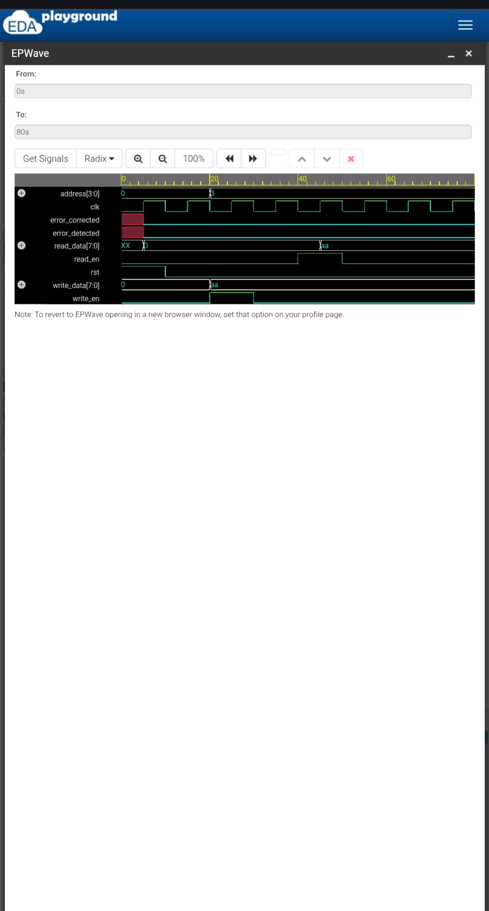

# Memory Interface in VLSI Systems using Verilog HDL

## 📌 Project Overview

This project implements a simple memory interface for a VLSI system using Verilog HDL.

The design demonstrates basic memory read and write operations using RTL (Register Transfer Level) design methodology. The project is verified through functional simulation using a Verilog testbench and waveform analysis.

## 🎯 Objectives

- To design a memory interface using Verilog HDL.
- To implement memory read and write operations.
- To understand RTL-based hardware design.
- To verify the design using a testbench.
- To analyze simulation waveforms using EPWave.

## 🛠️ Technologies Used

- Verilog HDL
- RTL Design
- Icarus Verilog
- EPWave
- EDA Playground
- GitHub

## ⚙️ Design Specifications

| Parameter | Value |
|---|---|
| Memory Locations | 16 |
| Data Width | 8-bit |
| Address Width | 4-bit |
| Design Method | RTL |
| HDL | Verilog |
| Simulation Tool | Icarus Verilog |
| Waveform Viewer | EPWave |

## 🔑 Main Features

- 16 memory locations
- 8-bit data storage
- 4-bit address selection
- Synchronous write operation
- Synchronous read operation
- Reset functionality
- Functional simulation
- VCD waveform generation
- Waveform analysis using EPWave

## 📂 Project Files

### `design.sv`

Contains the Verilog RTL design of the memory interface.

### `testbench.sv`

Contains the testbench used to verify the memory read and write operations.

### `IMG_20261002_112730.jpg`

Contains the simulation waveform captured from EPWave.

## 🔄 Working Principle

### 1. Reset

The reset signal initializes the memory interface and output signals.

### 2. Write Operation

When `write_en` is enabled, the input data is stored in the selected memory location using the given address.

### 3. Read Operation

When `read_en` is enabled, the data stored at the selected address is transferred to the `read_data` output.

### 4. Simulation

The testbench generates the clock and applies different input conditions to verify the functionality of the memory interface.

## 🧪 Verification

The design was functionally simulated using Icarus Verilog.

The testbench verifies:

- Reset operation
- Memory write operation
- Memory read operation
- Address selection
- Data transfer

A VCD file was generated during simulation and viewed using EPWave to analyze the timing behavior of the design.

## 📊 Simulation Waveform

The following waveform shows the behavior of the clock, reset, read/write control signals, address, input data, and output data during simulation.

## 📈 Expected Result

The data written into the selected memory address is successfully read back during the read operation.

Example:

- Address: `3`
- Write Data: `10101010`
- Read Data: `10101010`

This confirms the basic read/write functionality of the memory interface.

## 🚀 Future Enhancements

The project can be further enhanced by adding:

- Hamming-based Error Detection and Correction (EDAC)
- Single-bit error correction
- Double-bit error detection
- Memory fault injection
- Advanced verification using SystemVerilog
- FPGA implementation
- Improved memory architecture

## 📚 Learning Outcomes

Through this project, I gained practical knowledge of:

- Verilog HDL
- RTL design
- Memory interface design
- Testbench development
- Functional simulation
- VCD waveform generation
- Waveform analysis
- GitHub project documentation

## 👩‍💻 Author

**Amudha S**

B.E. Electronics and Communication Engineering

### Areas of Interest

- VLSI
- Embedded Systems
- IoT
- Verilog HDL

## 🔗 Project Repository

This repository contains the Verilog RTL design, testbench, and simulation waveform for the memory interface project.
